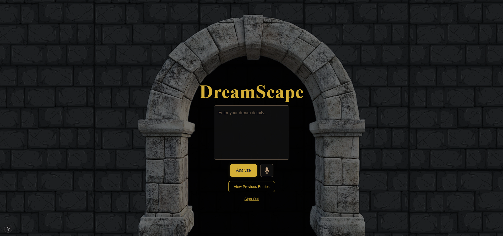
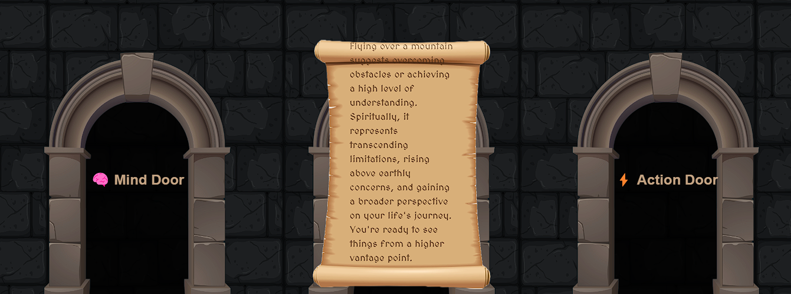

# DreamScape: A Journey of Self-Discovery Through Your Dreams

## Overview
*DreamScape* is a full-stack web application built for Deerhacks IV 2025 that helps users analyze their dreams through AI-powered interpretations. Users can input dreams via text or speech and receive three unique perspectives: psychological (Mind Door 🧠), symbolic (Spirit Door 🔮), and actionable (Action Door ⚡). This project was developed in a 36-hour hackathon by a collaborative team.

## My Contribution
For *DreamScape*, I focused on designing and implementing the backend infrastructure for user management and dream logging, although time constraints prevented full integration into the final product. My contributions include:

- **Database Design**: Created a SQLite database schema to store user accounts and dream entries, including tables for users (with fields like username, password hash) and dreams (linked to users with dream text and timestamps).
- **Schema Models**: Defined lightweight, relational models in SQLite to efficiently manage user data and their corresponding dream logs.
- **RESTful API Endpoints**: Built Express.js API routes for:
  - User creation (`POST /api/users`) with basic registration functionality.
  - User login/logout (`POST /api/login`, `POST /api/logout`) using session-based authentication.
  - Dream entry management (`POST /api/entries`, `GET /api/entries`, `DELETE /api/entries/:id`) to save, retrieve, and delete dream logs.
- **Future-Ready Backend**: Structured the API and database to seamlessly integrate with the frontend and NLP components, though this wasn’t completed due to the one-day time limit.

While the database and API weren’t connected in the final demo, they represent a scalable foundation for future iterations.

## Technologies Used
- **SQLite**: Lightweight database for storing user and dream data.
- **Express.js**: Backend framework for RESTful API endpoints.
- **Node.js**: Server-side runtime environment.
- **JavaScript**: Core language for backend logic.

## Project Features (Team Effort)
- **Frontend**: Built with Next.js, React, and Tailwind CSS for a medieval-themed, scroll-based UI.
- **NLP & AI**: Python with NLTK for dream text processing, integrated with Google Gemini AI for interpretations.
- **Speech-to-Text**: Real-time transcription for dream narration.

## How It Works (My Part)
- **Database**: The SQLite schema includes two main tables:
  - `Users`: Stores user ID, username, and a password.
  - `Dreams`: Stores dream ID, user ID (foreign key), dream text, and timestamp.
- **API**: Endpoints handle CRUD operations for users and dreams, designed to support login sessions and dream journaling.

## Challenges
- Designing a lightweight yet extensible database schema in a short timeframe.
- Ensuring API endpoints were secure and RESTful despite limited testing time.
- Lack of integration time due to the 24-hour hackathon constraint.

## What I Learned
- Rapid prototyping of RESTful APIs and database schemas under tight deadlines.
- Balancing scalability with simplicity in SQLite for a small-scale project.
- Collaboration across frontend, backend, and AI components in a team setting.

## What’s Next
If continued, I’d:
- Integrate the database and API with the frontend for a fully functional app.
- Add encryption for user passwords and session management.
- Expand the schema to store AI-generated interpretations alongside dream entries.

## Team
- **Pratham Vijh**: Led frontend development.
- **JahangirMinhas Minhas**: Worked on speech-to-text and full-stack integration (see their Devpost profile!).
- **Tejovardhan Nepala**: AI Integration.
- **Me**: Backend database and API development.

## Links
- *[Deerhacks IV 2025 Submission](https://devpost.com/software/dreamspace?ref_content=user-portfolio&ref_feature=in_progress)*
---
*Built in 36 hours for Deerhacks IV 2025 🚀✨
